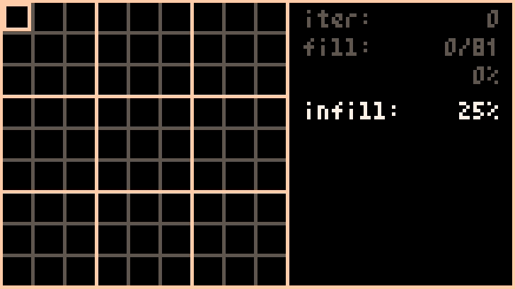
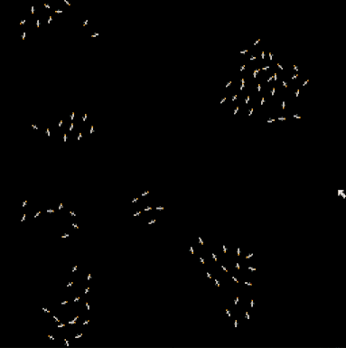

# Pyxel Games

This is small collection of games written in python using [pyxel](https://github.com/kitao/pyxel).

## Sudoku Solver

### Controls
* `WASD` to move the cursor
* `0, ..., 9` to mark selected cell
* `space` to start/stop the solve
* `UP, DOWN` to set the riddle fill percentage
* `enter` to generate riddle

### Approach
The general approach used in this solver is a brute-force solve using back-tracking enhanced with a bit of domain knowledge:
1. each cell on the board has a set of entry candidates
2. cells with less entry candidates are preferred
3. entry candidates that are less common are preferred
4. cells with the least common entry candidates are preffered

## Maze generation

### Controls
* Move mouse and click to generate a maze

### Approach
This little app implements maze generation through simple stack-based backtracking.

## Boid swarms

### Controls
* `mouse left` attract to cursor
* `mouse right` repel from cursor

### Appraoch
This is a simple implementation of so called [boids](http://www.red3d.com/cwr/boids/), which are the brain child of [Craig Reynolds](http://www.red3d.com/cwr/index.html). The general idea behind them is that one can simulate a flocking swarm of entities by applying just 3 simple rules:
1. Seperation: steer to avoid crowding local flockmates
2. Alignment: steer in a similar direction to local flockmates
3. Cohesion: steer towards the center of the local flock

In addition to these three simple rules I've also add a common extension, by which one can give the boids a target to head towards or away from.