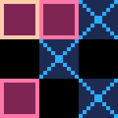
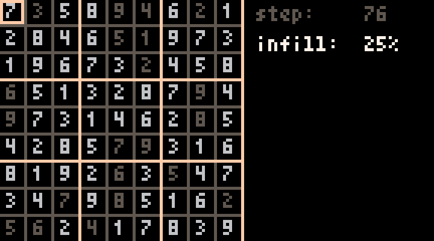
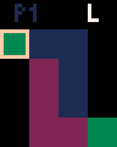

# Pyxel Games

This is small collection of games written in python using [pyxel](https://github.com/kitao/pyxel).

## Tic-Tac-Toe

### Controls
* `WASD` to move the cursor
* `space` to mark selected cell
* `Q` to forfit the match

## Sudoku Solver

### Controls
* `WASD` to move the cursor
* `0, ..., 9` to mark selected cell
* `space` to start solve
* `UP, DOWN` to set the riddle fill percentage
* `enter` to generate riddle
* `numpad 4, 1` to set `R width`
* `numpad 5, 2` to set `R limit`
* `numpad 6, 3` to set `R count`

### Approach
The general apporach used in this solver is a brute-force solve using back-tracking enhanced with a bit of domain knowledge such as what can actually go into any given cell at any point in time and that cells with less entry candidates are to be preferred/filled first.

This approach suffers from oscillations from time to time, by which I mean that the the back-tracking can get stuck in branch of the move-tree, and takes a very long time to get back out. The simplest remedy to this is to restart the solve once you decide you've tried around enough. I implemented this idea as follows:
1. get the total board difference between the n-th and the (n-`R width`)-th iterations
2. if the difference surpasses a certain threshold (`R limit`) add 1 to the reset counter
3. once you've detected a certain amount (`R count`) of such reset-conditions, restart the solve

## Lgame

### Controls
* `WASD` to move the cursor
* `space` to start, end, and terminate the selection
* `Q` to forfit the match

### TODO
* win/loss detection still has some bugs that should be fixed/removed

